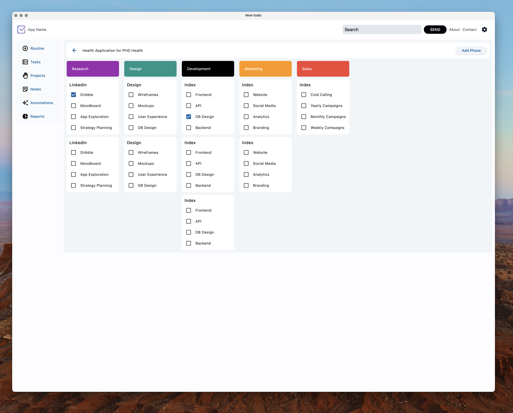

# App Name

Description or purpose of this app

**To run the app:**

`flet run`

**To package the app for MacOS:**

`flet pack main.py`

**To package the app for Windows:**

`flet pack main.py`

# Things to do

- [x] Basic working UI
- [ ] Upload to Github
- [ ] Code Refactoring
- [ ] Add ORM
- [ ] Basic CRUD
- [ ] Polish
- [ ] Add Documentation

# Schema

## User

A "user" refers to a persona representing the target audience for the app. It's not a specific individual but rather a character that embodies the characteristics, needs, and goals of the people who will be using the app.

|column|description|
|--|--|
|id|unique id of the user|
|email|email address of the user|
|password|password of the user|
|role|basic,manager,admin,persona|

## Project

This is the big picture, the entire app you're developing. It encompasses all the work from initial concept to final launch and potentially even future updates.

|column|description|
|--|--|
|id|unique id of the project|
|name|name of the project|

## Phase

A project is typically divided into smaller, more manageable phases. These phases represent distinct stages in the development process, like "Planning," "Design," "Development," "Testing," and "Deployment." Each phase has a specific goal and set of deliverables.

|column|description|
|--|--|
|id|unique id of the phase|
|name|name of the phase|

## Epic

A large, complex feature that contributes significantly to the overall functionality of the app. Epics usually span multiple development phases and require significant effort to complete. They represent a significant user benefit or a major technical hurdle.

|column|description|
|--|--|
|id|unique id of the epic|
|name|name of the epic|

## Task

A task (sometimes referred to as a feature) is a discrete piece of functionality within the app. It delivers a specific value to the user and can be independently developed, tested, and deployed.  Tasks are smaller and more focused than epics. 

|column|description|
|--|--|
|id|unique id of the task or task|
|description|short description of the task|

**Relationships**

- A PROJECT has many PHASES. A PHASE belongs to a PROJECT
- A PHASE has many EPICS. An EPIC belongs to a PHASE
- An EPIC has many TASKS. A TASK belongs to an EPIC
- A USER can have many PROJECTS. A PROJECT can have many USERS
- A USER can have many TASKS. A TASK belongs to one USER

# Functional Requirements

- Create a TASK
- Create a PROJECT
- Add a PHASE to a PROJECT
- Add a PHASE group to a PHASE
- add a TASK to an EPIC
- CRUD Projects, Phases, Epics and Phases

# Non Functional Requirements

- Beautiful UI
- Useful (has utility)
- Stable (tested)

# Business Rules

Business rules are specific instructions that define how a business operates and guide decision-making.

**Project Level:**

1. **Project creation requires:** A unique name, a clear description, budget definition, deadline specification, and stakeholder role assignment.
2. **Project budget cannot be exceeded:** Expenses must be tracked, and triggering a pre-defined threshold percentage sends notifications for budget review.
3. **Project deadline extension requires:** Approval from a designated authority (e.g., project manager, client) with justification and potential impact assessment.

**Phase Level:**

4. **A phase cannot be marked "In Progress" until:** All preceding phases are marked "Completed."
5. **Phase status change triggers notification to:** Project stakeholders and assigned teams for the impacted phase.
6. **Phase duration exceeds estimation by X%:** Triggers a review process to assess root cause and potential adjustments to the project timeline.

**Epic Level:**

7. **Epics must be broken down into features:** With a minimum of Y features per epic.
8. **Features within an epic cannot be marked "Completed" until:** The epic itself is marked at least "In Progress."
9. **High-priority epics are prioritized for resource allocation:** When resource limitations exist.

**Feature Level:**

10. **Feature creation requires:** A clear description, acceptance criteria definition, dependency mapping with other features, and effort estimation.
11. **Features exceeding a pre-defined size threshold:** Must be further decomposed into smaller, more manageable sub-features.
12. **Feature completion triggers automated testing:** To ensure functionality meets acceptance criteria before marking it as "Completed."

**Task Level:**

13. **Tasks must be assigned to a specific team member:** With clear ownership and accountability.
14. **Task completion requires:** Marking the task as "Completed" by the assigned team member.
15. **Overdue tasks trigger notifications to:** Assigned team member and potentially project manager depending on severity.

**General Rules:**

16. **System maintains an audit log:** Tracking all user actions (create, edit, delete) for project, phase, epic, feature, and task data.
17. **User access control restricts actions:** Based on assigned roles and permissions within the project.
18. **Data backups are performed regularly:** Following a defined schedule to ensure data recovery in case of system failures.
19. **The system allows exporting project data:** In various formats (e.g., CSV) for reporting and external analysis.
20. **The system integrates with other development tools:**  (e.g., code repositories, bug tracking systems) to streamline the overall development workflow. 

These business rules define specific actions and conditions that the app should enforce to manage app development projects effectively.

# Other Features

- [ ] Reporting - creating reports and exporting data as CSV or PDF.
